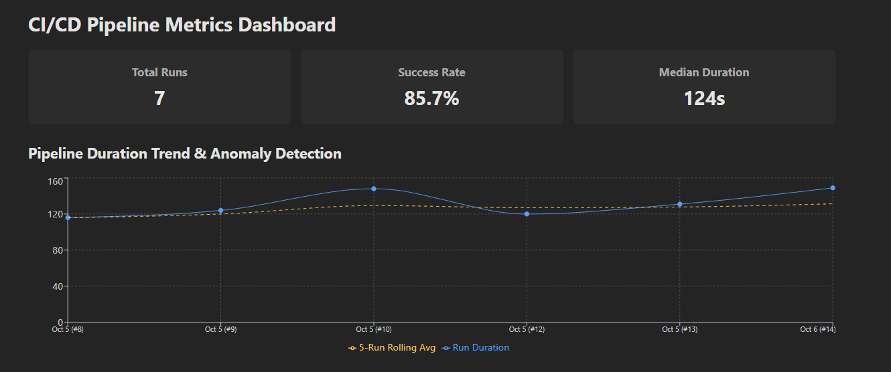
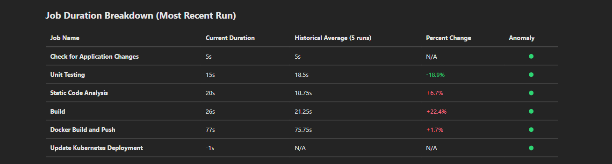
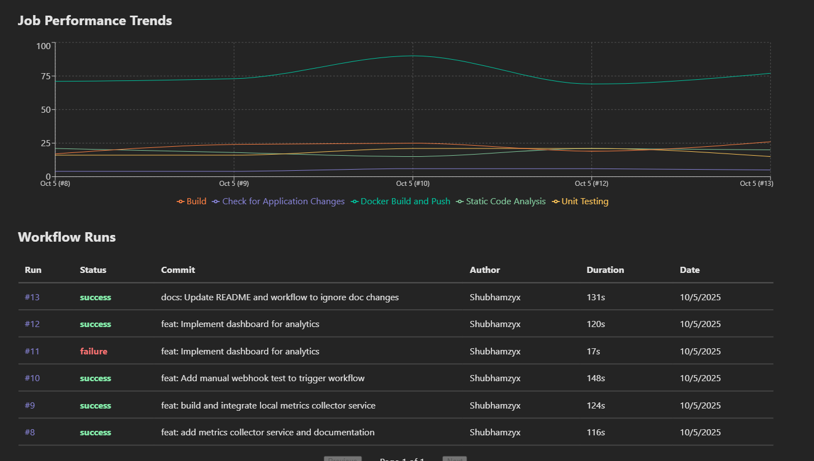

# Pulse

While standard CI providers focus on the current run status, Pulse focuses on **historical trends** and tells you if your pipeline is healthy.

Pulse is an observability engine that captures the complete history of your CI/CD runs. t detects silent performance regressions, catching those 10-second delays that turn into 10-minute waits, and uses AI to help you debug failures.

**Configure Pulse by adding a few lines to your workflow, and tracking begins immediately.**





## Why Pulse?

### 1. Dynamic Ingestion
Unlike fragile dashboards that require hardcoded job names, Pulse features a dynamic ingestion pipeline.
*   **Self-Provisioning:** Automatically provisions database schemas for new repositories and job steps the moment a webhook arrives.
*   **Resiliency:** Normalizes disparate CI/CD payloads, handling missing data or job renames gracefully without breaking the historical record.

### 2. Statistical Anomaly Detection
Pulse detects "silent" regressions that standard tools miss.
*   **Smart Baselines:** Uses a 5-run rolling average to filter out network noise and isolate real performance degradation.
*   **Drift Alerts:** Automatically flags any job step that deviates by >20% from its baseline, catching slow tests before they merge.

### 3. Root Cause Analysis
Instead of digging through thousands of lines of logs, use the built-in AI analysis to get a concise summary of why a run failed or took too long.

### 4. Unified View
Track multiple repositories in one place. Whether you have 5 microservices or a monolith, Pulse organizes all your build data into a single, clean dashboard.

## Integration

To start tracking a repo, add this step to the end of your `.github/workflows/ci.yml`. See **[pulse-action-setup.md](./pulse-action-setup.md)** for the full guide.

```yaml
- name: Send Metrics to Pulse
  uses: ./pulse-action
  if: always()
  with:
    webhook_url: ${{ secrets.PULSE_WEBHOOK_URL }}
    github_token: ${{ secrets.GITHUB_TOKEN }}
```

## Running Locally

1.  **Start Database:**
    ```bash
    docker-compose up -d
    ```

2.  **Start Backend:**
    ```bash
    cd metrics-collector && npm run build && npm run start
    ```

3.  **Start Dashboard:**
    ```bash
    cd dashboard-frontend && npm run dev
    ```

## Tech Stack

*   **Frontend:** React, Vite, Recharts
*   **Backend:** Node.js, Express, PostgreSQL
