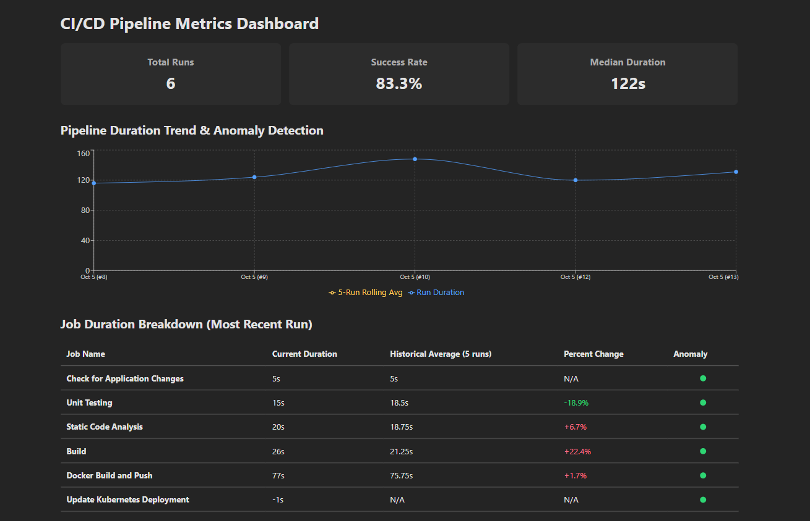
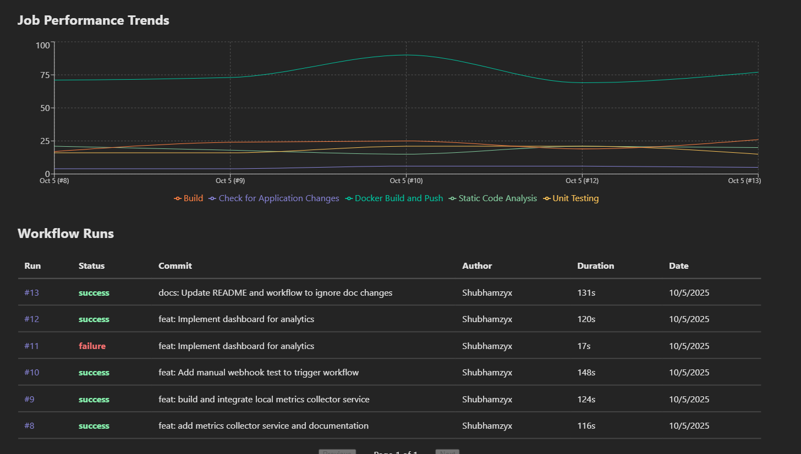

# Pulse: A CI/CD Pipeline Analytics Dashboard

Pulse is an analytics dashboard for monitoring the performance and health of CI/CD pipelines. It automatically gathers detailed metrics from every workflow run and visualizes them to help you identify trends, bottlenecks, and performance regressions.

## Key Features

*   **Pipeline Anomaly Detection:** Automatically flags pipeline runs that are significantly slower than the 5-run rolling average.

*   **Job Performance Trends:** Visualizes the historical duration of each individual job in a multi-line chart, making it easy to spot which parts of the pipeline are becoming slower over time.

*   **Recent Run Breakdown:** Provides a detailed table analyzing the most recent pipeline run, comparing each job's duration against its historical average.

*   **Core Health Metrics:** Displays high-level statistics like Success Rate and Median Run Duration for a quick, at-a-glance overview of pipeline health.

## How It Works

1.  A **GitHub Actions workflow** runs on a code push.
2.  A **Profiler** script collects detailed timing and status metrics from the completed run.
3.  The data is sent to a **Node.js Collector Service** and stored in a PostgreSQL database.
4.  A **React Dashboard** queries the service's API to visualize the data.

## Technology Stack

*   **Frontend:** React, TypeScript, Vite, Recharts
*   **Backend:** Node.js, Express, TypeScript
*   **Database:** PostgreSQL
*   **CI/CD:** GitHub Actions
*   **Containerization:** Docker
