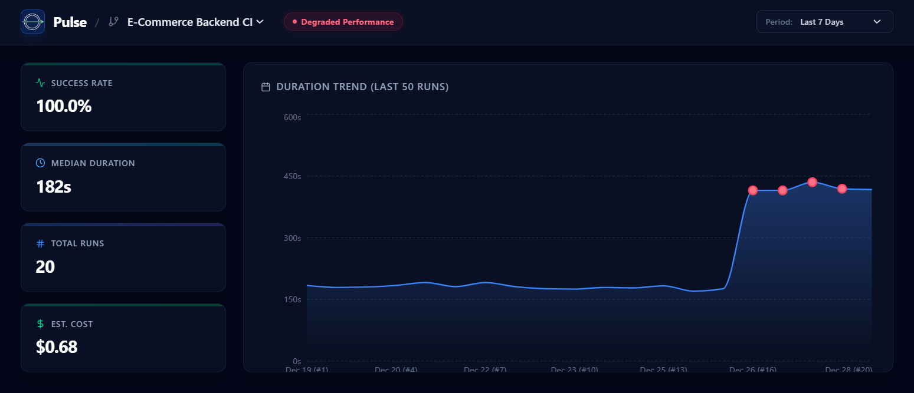
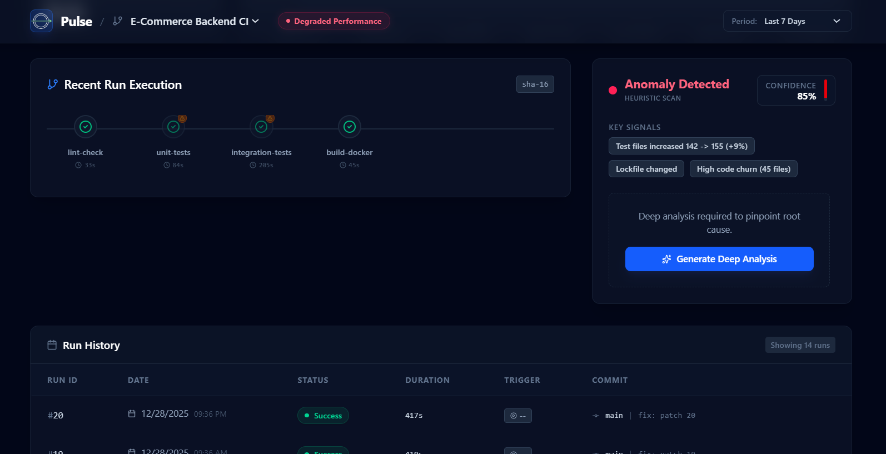
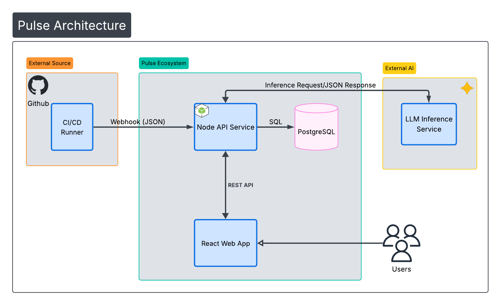

<p align="center">
  
</p>

# Pulse

Most CI systems answer one question: *did the last run pass?* 

A green check can hide the wasted CI time nobody tracks, flaky tests nobody fixes, and regressions that quietly slip into production.

Pulse continuously tracks **pipeline health**, spotting **reliability decay**, **slow-success patterns**, and **behavioral drift** so problems are caught before they trigger outages or waste compute.


Integration requires just a single workflow step. No agents, no sidecars, and no manual provisioning.



### Who This Is For
Built for engineering teams running 50+ workflows across multiple repos, where 1% flakiness costs hours of developer time, drives repeated triage, and burns compute every week.

## Key Features

### Heuristic Failure Classification
Before invoking AI, Pulse instantly scans logs against a library of known error patterns (e.g., `ETIMEDOUT`, `Lockfile Changed`, `OutOfMemory`). This provides immediate, low-cost categorization for common failures alongside a **Confidence Score**.


### Statistical Drift Detection
5-run rolling baselines filter temporary noise and surface both failures and slow-success regressions that traditional alerts miss.


### Context-Aware AI Root Cause Analysis  
AI correlates failure logs with commit diffs to narrow down which file changes are most likely associated with the regression, reducing investigation time from hours to minutes.
<p align="center">
  
</p>

### Zero-Config Dynamic Ingestion
GitHub Actions webhooks are ingested without predefined schemas.
Job renames, new steps, and missing fields do not invalidate historical data; new workflows are incorporated automatically on first execution.

### Cross-Repository Visibility
Provides a unified view across repositories, enabling teams to analyze CI performance trends at the organization level rather than per-project silos.

### Resource & Cost Efficiency
Estimates CI/CD compute costs per workflow to help teams identify expensive pipelines and correlate performance regressions with cost spikes.

## Design Decisions & Constraints

**Architecture Choices**
* Synchronous Webhook Processing: Operational simplicity was prioritized over peak throughput. This caps sustained ingestion at ~10 req/sec but avoids introducing a queueing layer in the MVP.
* On-Demand AI: AI-assisted analysis is triggered explicitly by user intent rather than on every run, controlling cost and avoiding unnecessary LLM calls.
* Rolling Baseline Detection: Baselines adapt as code and infrastructure evolve, accepting that historical flags may shift instead of enforcing static thresholds.

**Known Limitations**
* Push-event ingestion only: misses manual or scheduled runs
* Single-instance deployment: database connection pool can saturate under bursts
* No webhook retry mechanism; ingestion downtime can result in permanent data gaps

**Explicitly Out of Scope**
* Pulse monitors pipelines but does not orchestrate them (no job retries, pipeline triggering, or cross-workflow dependency tracking)


## System Architecture


## Integration

To start tracking a repo, add this step to the end of your `.github/workflows/ci.yml`. See **[pulse-action-setup.md](docs/pulse-action-setup.md)** for the full guide.


```yaml
- name: Send Metrics to Pulse
  uses: ./pulse-action
  if: always()
  with:
    webhook_url: ${{ secrets.PULSE_WEBHOOK_URL }}
    github_token: ${{ secrets.GITHUB_TOKEN }}
```

## Running Locally

1.  **Start Database:**
    ```bash
    docker-compose up -d postgres
    ```

2.  **Start Backend:**
    ```bash
    cd metrics-collector && npm run build && npm run start
    ```

3.  **Start Dashboard:**
    ```bash
    cd dashboard-frontend && npm run dev
    ```

## Tech Stack

*   **Frontend:** React, Vite, Recharts
*   **Backend:** Node.js, Express, PostgreSQL

