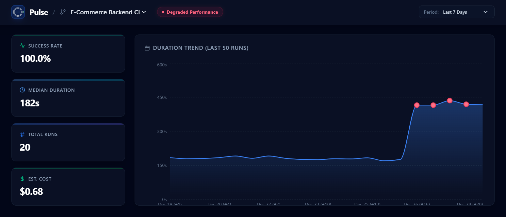
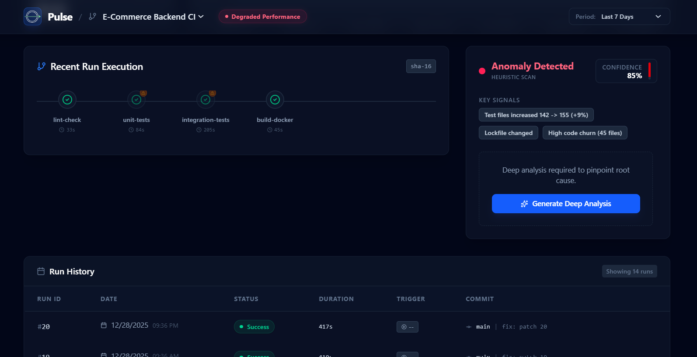
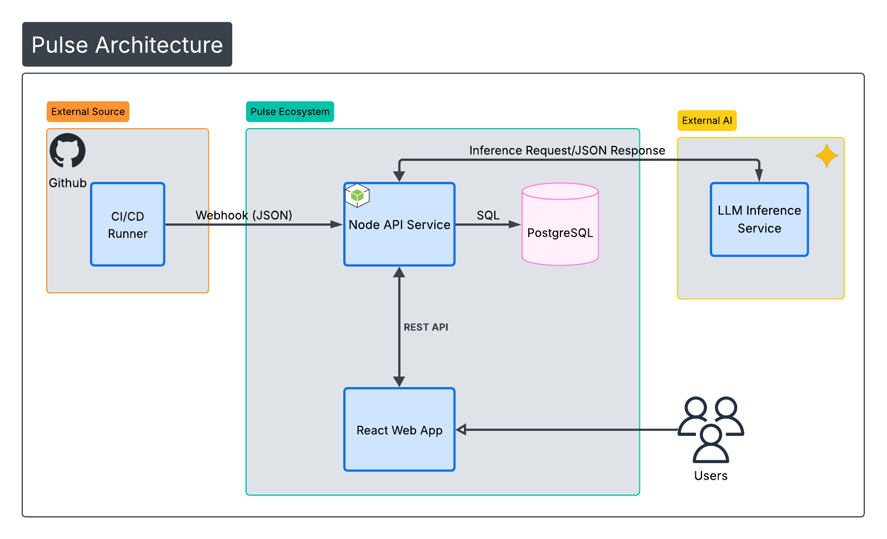

<p>
 
</p>

# Pulse
### Pipeline Degradation Intelligence for Modern CI

Most CI systems are binary: they tell you when a build passes or fails. But pipelines rarely fail overnight. Instead, reliability decays quietly over time. Flaky tests start to appear, build durations creep up, and small inefficiencies compound into structural instability and higher compute costs.

This phenomenon is often called **pipeline rot**, and Pulse is designed to detect it before it becomes a production issue.

With rapid iteration loops and AI-assisted coding, teams are merging code faster than ever. This increased velocity often introduces subtle pipeline entropy that traditional event-based CI tools miss. Pulse shifts the focus from simple pass/fail events to monitoring the actual **trajectory** of your workflows, catching degradation early.

<p>
  
</p>

---

## How It Works

Under the hood, Pulse ingests your GitHub Actions webhooks and automatically builds a rolling statistical baseline for every job. It evaluates each run against historical patterns to identify duration drift, flakiness, and resource pressure — without requiring you to configure manual thresholds or alerting rules.

When a pipeline's trajectory deviates significantly, Pulse raises an investigation signal and correlates the anomaly with recent commits to provide a structured Root Cause Analysis (RCA).

```json
{
  "run_id": "gh_run_8472910",
  "trajectory_status": "degrading",
  "signal": "job 'jest_test_suite' duration +38% (4m12s -> 5m48s)",
  "rca": {
    "suspect_commit": "a1b2c3d",
    "root_cause": "Added deep clone in utils/parser.ts inside the map function. Likely causing GC pauses.",
    "remediation": "Check if deep clone is strictly necessary here. Consider shallow copy or moving the clone operation outside the loop.",
    "confidence_score": 0.72
  }
}
```

---

## Agentic Escalation

To keep signal quality high and compute costs predictable, Pulse does not run every webhook through an LLM. It relies on **deterministic classification first**, using statistical drift and known error heuristics mathematically.

The system only escalates to an AI model when signals are ambiguous or highly impactful. In these cases, the LLM acts as a specialized consultant to pinpoint the responsible code changes — rather than just summarizing massive log dumps.

<p align="center">
  
</p>

---

## Queryable CI Context (MCP)

Pulse is built to be infrastructure, not just another dashboard. It exposes a native **Model Context Protocol (MCP) server**, which fundamentally changes how developers interact with CI failures.

Instead of hunting down a failed action and copy-pasting raw logs into an LLM window, external coding agents and local IDE extensions can directly query Pulse for the exact failure context. Your autonomous agent can retrieve the structured RCA mid-debug and immediately start applying the fix in your codebase.


<p>
  
</p>
---

## Technical Design & Scope

Pulse is designed around **schema-free ingestion** using PostgreSQL JSONB, meaning job renames, missing fields, and new workflow steps never break your historical data. It currently supports push-event webhook streams via a single-instance deployment and processes telemetry synchronously.

> For a deep dive into our signal extraction layers and architectural trade-offs, see [`docs/architecture.md`](docs/architecture.md).

---

## Integration

Getting started requires adding just a single step to your existing workflow. There is no pipeline orchestration required, and workflows are detected automatically on their first run.

```yaml
- name: Send Metrics to Pulse
  uses: ./pulse-action
  if: always()
  with:
    webhook_url: ${{ secrets.PULSE_WEBHOOK_URL }}
    github_token: ${{ secrets.GITHUB_TOKEN }}
```

---

## System Architecture 

## Local Setup

```bash
git clone https://github.com/your-org/pulse.git
cd pulse
export GOOGLE_API_KEY="your_gemini_api_key"

# Start the database
docker-compose up -d postgres

# Start the ingestion API
cd metrics-collector && npm run build && npm run start

# Start the dashboard
cd ../dashboard-frontend && npm run dev
```

---

**Stack:** Node.js · PostgreSQL · React · Gemini · MCP over SSE